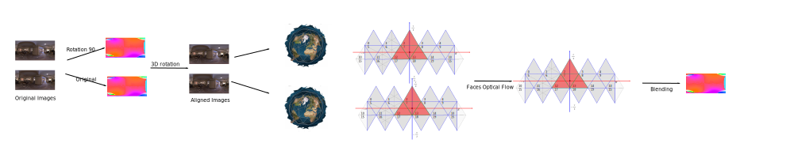

# 1. Target

BMVC 2021: [Official Website](https://www.bmvc2021.com/)

18 Jun 2021	Paper Abstract Deadline
25 Jun 2021	Paper Submission Deadline
02 Jul 2021	Supplemental Material Deadline

# 2. Related Work

## 2.1. Optical Flow

Energy Minimization:

The optical flow is formulated as energy minimization problem to find the most similiary pixel corresponding and regularization with local or global smooth term \cite{DIS, HS, BA}. Furthermore, 

\cite{Borx} propose warp base method, to update the optical flow with multi-iteration from previous iteration optical flow warped image.

\cite{sun} use midian filer in pose-processing step sharper objection boundary's the optical flow.

Supervised Learning:

- FlowNet 1,2,3,lite, lift the correlation operation and multi-scale method, which help the CNN effectly find the corresponding relationship from two RGB images. 

- PWCNet proposes the 4D volume to function the 

\cite{teed2020raft} use the recurrent network to update optical flow from the 4D correlation volume, 

Unsupervised Learning:

\cite{aleotti2021learning} propose a training data generateion method, 
which use estimated depth to generate new view point image and optical flow from single still image, to train the off-the-shelf optical flow method.
This method propose for self-supervised learn pathway.


## 2.2. panoramic Image processing

\cite{sun2020hohonet} proposed HoHoNet is a versatile method, their LHFeat is squeezed per-column feature, used to predict whole image information (depth map, semantic segmentation and layout reconstruction) with IDCT. 

- Layout:
  - \cite{}

- Depth:
  - \cite{wang2020bifuse} 
- 
- Semantic segmentation:


## 2.3. Dataset

<!--Realworld-->
3D Mesh dataset:
- Stanford2D3D \cite{armeni2017joint}
- Matterport3D
- Replica
- iGibson (Gibson)

360 Image dataset:
- MatterportLayout dataset: https://github.com/ericsujw/Matterport3DLayoutAnnotation, labeled scene
- 360D dataset:
- Structured3D: https://structured3d-dataset.org/, synthetic dataset,room layout estimation
- Omnidirectional Stereo Dataset: http://cvlab.hanyang.ac.kr/project/omnistereo/
- Realtor360: 


# 3. Method 

There are two steps:

**Method 1**: Warp based method (3DV 2021)

**Method 2**: CNN based method (CVPR 2021)
- [ ] Unsupervised Training, with warped image MISS /
  - Learning Stereo from Single Images
  - Learning optical flow from still images
- [ ] Change Choen's FFT to DCT, to solve the rotation invariance
- [ ] Kernel transform NN, 
- [ ] GNN the get the alignment coefficients;

## 3.1. Method 1

<p align="center"></p>
A pipeline image of method; 

### 3.1.1. Image Alignment


### 3.1.2. Sub-Image Optical Flow
Geodesic polyhedron.


### 3.1.3. Sub-Image Optical Flow Blending


#### 3.1.3.1. Traditional Method

Generate the weight function:


#### 3.1.3.2. CNN Method

The CNN structure, and how to train.


### 3.1.4. Panoramic Image Optical Flow Generation

- [ ] Explain the 360 optical flow the shader;
- [ ] Fix the rendering code and generate a 360 dataset;
- [ ] Implement the code and test on Replica dataset;

### 3.1.5. Experiment

- [ ] Compare with others methods;
- [ ] How rotation affects accuracy?

### 3.1.6. Limitation

### 3.1.7. Conclusion


## 3.2. Geodesic Subdivision 

Principal polyhedron triangle are the seeds of ,
The face of the principal polyhedron is call principal polyhedron triangle (PPT).
The PPT face is subdivided by 

Loop Subdivision:

1. http://www.neolithicsphere.com/geodesica/doc/subdivision_classes.htm
2. https://en.wikipedia.org/wiki/Geodesic_polyhedron
3. http://pibeta.phys.virginia.edu/docs/publications/ketevi_diss/node34.html
4. https://graphics.stanford.edu/~mdfisher/subdivision.html


5. implement: https://www.opengl.org.ru/docs/pg/0208.html
6. implement: http://blog.coredumping.com/subdivision-of-icosahedrons/


7. Reference software: http://www.neolithicsphere.com/geodesica/index.htm


## 3.3. Gnomonic Projection

Azimuthal equidistant projection

https://en.wikipedia.org/wiki/Azimuthal_equidistant_projection

https://fr.maplesoft.com/applications/view.aspx?SID=3583&view=html

https://casa.nrao.edu/aips2_docs/memos/107/node2.html

https://casa.nrao.edu/aips2_docs/memos/107/node2.html#SECTION00021100000000000000

http://www.geography.hunter.cuny.edu/~jochen/GTECH361/lectures/lecture04/concepts/Map%20coordinate%20systems/Perspective.htm


## 3.4. Reference

Reference: https://medium.com/@deviparikh/planning-paper-writing-553f497e8839

# 4. Code


## 4.1. Folder structure

```
.
├── paper_draft: latex file;
├── paper_draft/image: images for documents;
├── optical_flow_evaluation.md: the document of how to evaluate performance of optical flow.
├── README.md
```

`paper_draft` folder is paper's draft;
`tech_detail` is including the code technical detial;
`paper_plane` is the plane of the paper.


## 4.2. Data Convention

### 4.2.1. Numpy shape

The image and flow data store in Numpy array.
Image array shape is [height, width, 3], and optical flow array shape is [height, width, 2].

### 4.2.2. Coordinate System Convention

In this project the default coordinate system same as the following image.
- x,y and z are the cartesian coordinate system notation.
- φ and θ are the spherical coordinate system notation, which are the longitude and latitude respectively.
- u and v are the the image coordinate system notation, which are the column and row index respectively.


**Cartesian coordinate system (3D)**

The +X is right, +Y is down and +Z is forward (Right hand coordinate system), and the origin [0,0,0] is overlap with the spherical coordinate system.

**Gnomonic coordinate system (Tangent Image)**

The tangent image show in the image as a pink square.
It's generated with gnomonic projection (xy) is the gnomonic plane coordinate system (normalized coordinate) whose origin is image center, +x is right, + y is up. And the tangent point is the origin of image.

And the uv are the gnomonic image coordinate system whose origin is image top-left.

About the gnomonic projection please reference https://mathworld.wolfram.com/GnomonicProjection.html

**Spherical coordinate system**

Its origin is overlap with cartesian coordinate system.
The θ axis range is [-π, +π) which is consistent with xz plane.
And φ axis range is [-0.5 * π, + 0.5 * π) which is consistent with yz plane.

This project also use (longitude, latitude) spherical coordinate system notationm which is same as (theta, phi)

This project use a special convention introduces in Jump.
https://developers.google.com/vr/jump/rendering-ods-content.pdf

**Equirectangular Image**

The ERP image pixels coordinate origin is Top-Left, and the image row and column index are v and u, is in range [0, width) and [0, hight) respectively.

And the ERP image's spherical coordinate origin at image center, phi (latitude) and theta(theta) is (0,0).
The first pixel 0 is corresponding azimuth -π, and the last pixel image_width - 1 is corresponding +π.
The theta is [-π, +π), phi is [-0.5*π, +0.5*π].

### 4.2.3. Optical flow

The optical flow U is corresponding theta, and V is corresponding theta.
The optical flow data structure layers order are U and V.

### 4.2.4. Wrap around 

The default, the ERP optical flow wrap around. 
For example, if a pixel from the [0.8𝜋,0] cross the theta [+𝜋,-] to [-0.9𝜋,0], the pixel's optical flow is +0.3𝜋 not 1.7𝜋.
The project name this optical flow as ERP optical flow.
And another type of optical flow as Non-ERP optical flow.

