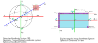

# Folder structure

```
.
├── draft: latex file;
├── reference: the reference parpers;
├── image: images for documents;
└── optical_flow_evaluation.md: the document of how to evaluate performance of optical flow.
```

# Data  convention

## Numpy shape
The image and flow data store in Numpy array.
Image array shape is [height, width, 3], and optical flow array shape is [height, width, 2].

# Coordinate System Convention

In this project the default coordinate system same as the following image.
- x,y and z are the cartesian coordinate system notation.
- φ and θ are the spherical coordinate system notation, which are the longitude and latitude respectively.
- u and v are the the image coordinate system notation, which are the column and row index respectively.



## Cartesian coordinate system (3D):

The +X is right, +Y is down and +Z is forward (Right hand coordinate system), and the origin [0,0,0] is overlap with the spherical coordinate system.

## Gnomonic coordinate system (Tangent Image): 

The tangent image show in the image as a pink square.
It's generated with gnomonic projection (xy) is the gnomonic plane coordinate system (normalized coordinate) whose origin is image center, +x is right, + y is up. And the tangent point is the origin of image.

And the uv are the gnomonic image coordinate system whose origin is image top-left.

About the gnomonic projection please reference https://mathworld.wolfram.com/GnomonicProjection.html

## Spherical coordinate system:

Its origin is overlap with cartesian coordinate system.
The θ axis range is [-π, +π) which is consistent with xz plane.
And φ axis range is [-0.5 * π, + 0.5 * π) which is consistent with yz plane.

This project also use (longitude, latitude) spherical coordinate system notationm which is same as (theta, phi)

This project use a special convention introduces in Jump.
https://developers.google.com/vr/jump/rendering-ods-content.pdf

## Equirectangular Image

The ERP image pixels coordinate origin is Top-Left, and the image row and column index are v and u, is in range [0, width) and [0, hight) respectively.

And the ERP image's spherical coordinate origin at image center, phi (latitude) and theta(theta) is (0,0).
The first pixel 0 is corresponding azimuth -π, and the last pixel image_width - 1 is corresponding +π.
The theta is [-π, +π), phi is [-0.5*π, +0.5*π].

# Optical flow

The optical flow U is corresponding theta, and V is corresponding theta.
The optical flow data structure layers order are U and V.

## Wrap around 

The default, the ERP optical flow wrap around. 
For example, if a pixel from the [0.8𝜋,0] cross the theta [+𝜋,-] to [-0.9𝜋,0], the pixel's optical flow is +0.3𝜋 not 1.7𝜋.
The project name this optical flow as ERP optical flow.
And another type of optical flow as Non-ERP optical flow.

## Gnomonic Projection

Azimuthal equidistant projection

https://en.wikipedia.org/wiki/Azimuthal_equidistant_projection

https://fr.maplesoft.com/applications/view.aspx?SID=3583&view=html

https://casa.nrao.edu/aips2_docs/memos/107/node2.html

https://casa.nrao.edu/aips2_docs/memos/107/node2.html#SECTION00021100000000000000

http://www.geography.hunter.cuny.edu/~jochen/GTECH361/lectures/lecture04/concepts/Map%20coordinate%20systems/Perspective.htm


# Method

Current, there are two step:

1st step: Warp based method
- [ ] Implement the code and test on Replica dataset;
- [ ] Fix the rendering code and generate a 360 dataset;
- [ ] Compare with others methods;
- [ ] 3DV 2021

2nd step: CNN based method
- [ ] Unsupervised Training, with warped image MISS
- [ ] Change Choen's FFT to DCT which reduce the 
- [ ] Kernel transform NN;
- [ ] CVPR 2021


## Method 1

- [ ] A pipeline image of method; 
- [ ] Explain the 360 optical flow the shader;


Geodesic polyhedron.

## Geodesic Subdivision 

Principal polyhedron triangle are the seeds of ,
The face of the principal polyhedron is call principal polyhedron triangle (PPT).
The PPT face is subdivided by 

Loop Subdivision:


**Reference**

1. http://www.neolithicsphere.com/geodesica/doc/subdivision_classes.htm
2. https://en.wikipedia.org/wiki/Geodesic_polyhedron
3. http://pibeta.phys.virginia.edu/docs/publications/ketevi_diss/node34.html
4. https://graphics.stanford.edu/~mdfisher/subdivision.html


5. implement: https://www.opengl.org.ru/docs/pg/0208.html
6. implement: http://blog.coredumping.com/subdivision-of-icosahedrons/


7. Reference software: http://www.neolithicsphere.com/geodesica/index.htm

# Folder Structure

```
.
├── README.md
├── paper_draft
├── paper_plane
└── tech_detail
```

`paper_draft` folder is paper's draft;
`tech_detail` is including the code technical detial;
`paper_plane` is the plane of the paper.

# Plan

3DV 2021: [Official Website](https://3dv2021.surrey.ac.uk/))

## Deadline: 

Paper registration	July 23, 2021
Paper submission	July 30, 2021
Demo submission	July 30, 2021
Supplementary	August 8, 2021

# Reference

Reference: https://medium.com/@deviparikh/planning-paper-writing-553f497e8839
